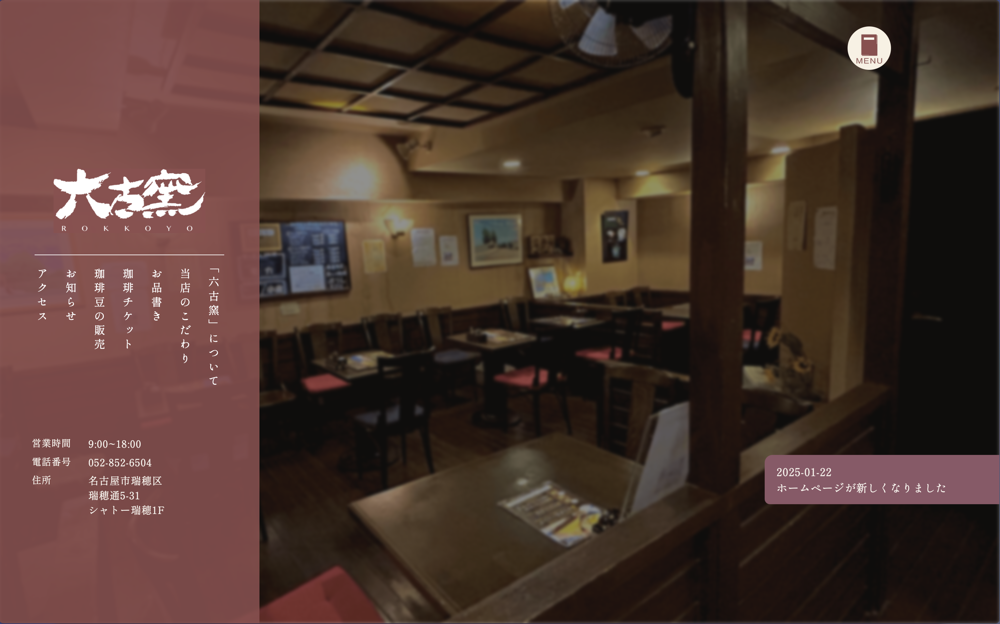
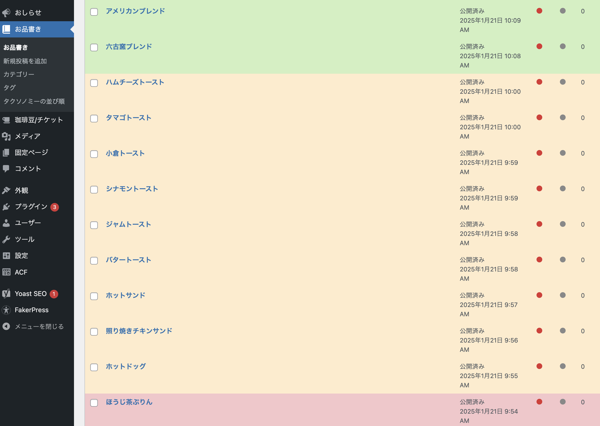

## 作品概要

進級制作として、喫茶店の六古窯瑞穂店さまにご協力いただきホームページを制作しました。
デザイン、コーディングなど全て自主制作です。 
作品リンク：[六古窯 瑞穂店](https://aoshima.pupu.jp/rokkoyo)

### 制作期間
3ヶ月(2024年10月~1月/週3コマ)

## 背景

進級制作にあたり、知人のお店に依頼をしてサイトを作らせていただきました。 
すでにホームページがあったためリニューアルという形になります。

## 調査

一人一人の時間を過ごすという、お店の方針上聞き込みはNG。オーナー様の話によるとほとんどが常連客。 
うち年齢層は40代~70代と高い。コーヒーが評判で常連客のほとんどがコーヒーチケットを購入している。 
新規客については、ばらつきはあるもののGoogleレビューや食べログに月に1つほど投稿されており、 
確かに新規が訪れていることがわかった。恐らくインターネットで知って来店している。こちらもコーヒーが好評。 
お店のSNSは無し。

## サイトの狙い
さらに新規客を取り込む 
*新規客▶︎食べログなど見る▶︎HPを見る▶︎お店に来店したくなる*

## 制作
**サイト構成**  
- トップページ
- メニュー一覧ページ(カテゴリーごと)
- お知らせ一覧ページ
- お知らせ個別ページ

**デザイン情報**  

- フォント：しっぽり明朝
- メインカラー：  
- サブカラー：  

**ポイント**  
コーヒーの評判の良いお店だったためコーヒーを連想させる要素を散りばめています。 
そのためメインカラーはブラウン、文字アニメーションはブラーがかかって出てくるものですが  
これはコーヒーの湯気をイメージしたものです。 
またバックグラウンドの色はお店の壁をモチーフにしました。 
左上のロゴは、ファーストビューでは必要性のないもののため、次のセクションまでスクロールすると  
出現する様にしました。そして慣性スクロールを採用しており、これによってお店のゆったりとしたコンセプト  
を表現しています。
お店のSNSがないことからお知らせ機能を投稿できる様WordPressを使用しています。  
またサイト内の料金表示部分はWordPress内で変更できる様実装しました。  
メニューページも随時更新が可能で、こちらは投稿量が膨大になることを想定し、  
視認性の観点から管理画面でカテゴリーごとに色分けがされるようにしています。  
加えて投稿ごとのアイコンにも変更を加えわかりやすくしました。 
 

 
ローディングアニメーションはAfterEffectsを使用し作成、JSにて実装しました。

## 使用技術・ソフト

